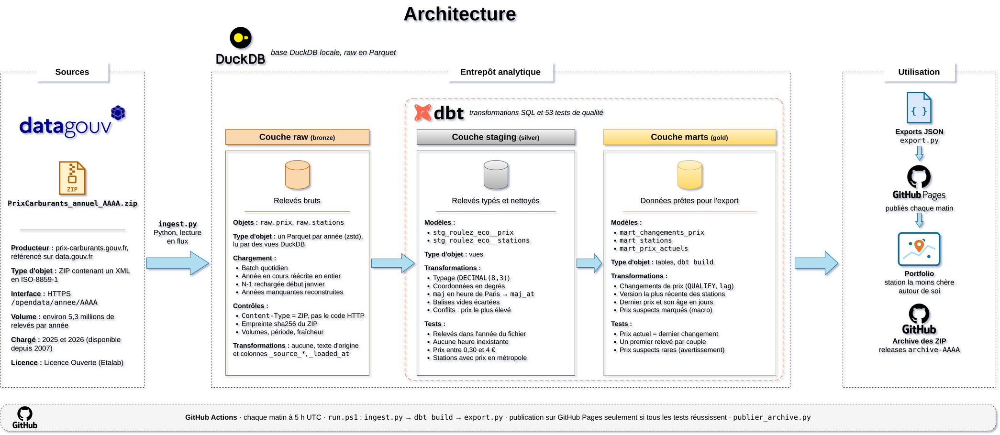
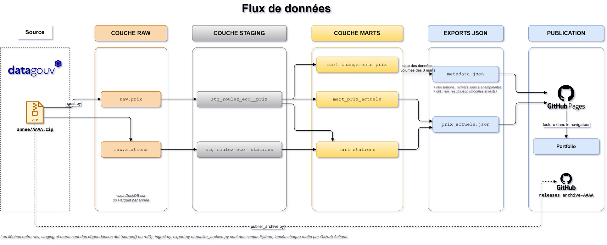

# Prix des carburants en France

Pipeline de données construit à partir des **fichiers XML des prix des carburants** publiés par l'État (donnees.roulez-eco.fr, Licence Ouverte) : ingestion en Python, stockage en Parquet lu par DuckDB, transformations et tests avec dbt, export JSON pour une page de portfolio.

Chaque matin, le pipeline récupère les prix de toutes les stations, garde l'historique complet des changements de prix, et le portfolio affiche la station la moins chère autour de la position de la personne.

> **Statut** : ingestion, staging et marts en place, 53 tests au vert. 2025 et 2026 sont chargés : 9,5 millions de relevés, 5,2 millions de changements de prix, 10 112 stations. Chaque test singulier a été vu en échec sur un défaut injecté. L'export JSON, le pipeline en une commande et le workflow GitHub Actions quotidien sont écrits ; le workflow reste à activer en publiant le dépôt sur GitHub.

## Objectif

Le projet met en pratique :

- une ingestion **quotidienne** d'une source publique, qui résiste aux pièges du serveur ;
- une couche `raw` fidèle à la source et traçable ;
- la reconstitution d'un **historique d'événements** (changements de prix) à partir de relevés répétés ;
- une gestion rigoureuse du **fuseau horaire** d'horodatages sans fuseau ;
- des limites des données mesurées, écrites et vérifiées par des tests.

## Démarrage rapide

```powershell
python -m venv .venv
.venv\Scripts\Activate.ps1
pip install -r requirements.txt

.\run.ps1                     # première fois : 2025 et 2026 ; ensuite : l'année en cours (environ 6 min)
.\run.ps1 2025 2026           # années imposées

python verifier_tests_en_echec.py   # chaque test singulier doit détecter son défaut (environ 6 min)
```

Sous Linux ou macOS, avec PowerShell 7 : `pwsh ./run.ps1`. Si `.venv` existe, `run.ps1` l'utilise même s'il n'est pas activé.

`run.ps1` enchaîne les trois étapes, chronomètre chacune et s'arrête à la première en échec (code de sortie 1) :

1. `python ingest.py` télécharge les fichiers annuels, les archive et réécrit les Parquet des années traitées.
2. `dbt build` crée les modèles `staging` et `marts` et lance les 53 tests. Un test en échec bloque les modèles qui en dépendent.
3. `python export.py` écrit `exports/prix_actuels.json` et `exports/metadata.json`.

Le projet s'arrête à la préparation des données. Chaque matin, GitHub Pages publie les deux fichiers JSON :

- `https://majin-m.github.io/Carburant/prix_actuels.json`
- `https://majin-m.github.io/Carburant/metadata.json`

La page du portfolio, dans un autre dépôt, les lit directement dans le navigateur à chaque visite et calcule elle-même les distances : les prix affichés sont ceux du jour, sans reconstruire le portfolio.

### Ingestion

Sans année, `ingest.py` traite :

- l'année en cours ;
- l'année précédente pendant les 15 premiers jours de janvier, car son fichier n'est finalisé que quelques jours après le 1er janvier ;
- toute année depuis `PREMIERE_ANNEE` (2025) dont les Parquet manquent : à la première exécution, ou sur une machine neuve comme un runner GitHub Actions, l'historique est reconstruit sans rien préciser.

Le journal indique la raison de chaque année (`2026 (année en cours)`, `2025 (Parquet absents)`). Le ZIP du jour est réutilisé s'il a déjà été téléchargé ; `--forcer` le retélécharge.

Pour chaque année, le script enchaîne quatre étapes et s'arrête à la première en échec (code de sortie 1) :

1. **Téléchargement** du ZIP, contrôle du `Content-Type` et archivage du ZIP d'origine dans `data/archive/`.
2. **Calcul de l'empreinte** sha256 du ZIP.
3. **Lecture du XML et écriture des Parquet** : `prix` (une ligne par relevé) et `stations` (une ligne par point de vente, avec son adresse).
4. **Vérification des Parquet** : volumes, période couverte, anomalies signalées en avertissement.

Puis il met à jour les vues `raw.prix` et `raw.stations` dans `data/carburant.duckdb`, qui lisent tous les Parquet. Ces vues enregistrent le chemin absolu des Parquet : après un déplacement du dossier du projet, il suffit de relancer `ingest.py`.

Enfin, il nettoie l'archive : pour chaque année, il garde le ZIP le plus récent, puis le dernier ZIP de chaque semaine dont le contenu n'est pas déjà gardé. Le fichier 2025, définitif, retéléchargé chaque jour à l'identique, n'est conservé qu'une fois.

### Planification sur GitHub Actions

Le workflow [pipeline.yml](.github/workflows/pipeline.yml) lance le pipeline :

| Déclencheur | Ce qui tourne |
|---|---|
| Chaque matin à 5 h UTC (6 h ou 7 h à Paris) | `run.ps1`, publication sur GitHub Pages, `publier_archive.py` |
| Push sur `main` | `run.ps1`, `verifier_tests_en_echec.py`, publication sur GitHub Pages |
| Pull request sur `main` | `run.ps1`, `verifier_tests_en_echec.py`, sans rien publier |
| À la demande (onglet Actions) | comme un push, puis `publier_archive.py`, avec l'option de publier hors dimanche |

- **Sans état** : le runner repart de zéro à chaque fois. `ingest.py` retélécharge et reconstruit les années dont les Parquet manquent : 2025 prend environ 1 min 30 de plus, pour un pipeline sans cache ni stockage à entretenir.
- **Archive des ZIP** : `publier_archive.py` publie dans une release par année (`archive-2026`, `archive-2025`…) le ZIP du dimanche de l'année en cours, et toute version au contenu nouveau d'une année passée. Chaque fichier publié porte le début de son empreinte sha256 : le même contenu n'est jamais publié deux fois. Environ 1,5 Go par an.
- **GitHub Pages** : les fichiers JSON ne sont publiés que si le pipeline et les tests ont réussi : une page ne montre jamais des données qui ont échoué aux tests. La publication a lieu avant celle de l'archive, pour qu'un incident sur les ZIP ne bloque pas les prix du jour ; le workflow reste alors en échec, pour que l'incident se voie.
- **Résultats** : les fichiers JSON (artefact `exports`) et les journaux (artefact `journaux`, gardé même en cas d'échec) sont aussi téléchargeables 30 jours dans l'onglet Actions.
- **Activation** : une seule fois, dans les réglages du dépôt sur GitHub, *Settings → Pages → Build and deployment → Source : GitHub Actions*.
- **En cas d'échec** : pour une tâche programmée, GitHub envoie un courriel à la personne qui a modifié la programmation en dernier, et les journaux de l'artefact montrent l'étape `[ÉCHEC]` avec sa trace.

### Suivre une exécution

Chaque étape d'`ingest.py` est annoncée au début (`[DÉBUT]`), à la fin avec sa durée (`[OK]`) ou en cas d'échec avec la trace complète (`[ÉCHEC]`). La lecture du XML affiche sa progression tous les 500 000 relevés. Les messages vont à la fois dans le terminal et dans `logs/ingest.log`.

```text
2026-09-28 12:48:47 | INFO    | [DÉBUT] [2026] Lecture du XML et écriture des Parquet
...
2026-09-28 12:49:48 | INFO    | [OK]    [2026] Lecture du XML et écriture des Parquet en 61.02 s
2026-09-28 12:49:48 | INFO    | [DÉBUT] [2026] Vérification des Parquet
2026-09-28 12:49:48 | INFO    | Prix : 4 172 763 relevés, 9 774 stations avec prix, 35 478 couples station × carburant
2026-09-28 12:49:48 | INFO    | Période : du 2026-01-01T00:00:00 au 2026-09-27T23:59:00
2026-09-28 12:49:48 | WARNING | 4 978 balises <prix/> vides (stations sans prix dans l'année), gardées avec des colonnes NULL
2026-09-28 12:49:48 | INFO    | Dernier relevé vieux de 1 jour(s) : fichier à jour
2026-09-28 12:49:48 | INFO    | Stations : 14 793
2026-09-28 12:49:48 | WARNING | 69 stations sans coordonnées
2026-09-28 12:49:48 | INFO    | [OK]    [2026] Vérification des Parquet en 0.58 s
```

En cas d'échec, par exemple pour une année que le serveur ne propose pas :

```text
2026-09-28 12:29:33 | INFO    | [DÉBUT] [2000] Téléchargement
2026-09-28 12:29:33 | ERROR   | [ÉCHEC] [2000] Téléchargement après 0.23 s
SourceError: Content-Type 'text/html' au lieu de 'application/zip'
2026-09-28 12:29:33 | ERROR   | Ingestion interrompue après 0.23 s, voir le détail ci-dessus
```

dbt affiche de son côté chaque modèle et chaque test avec son statut (`OK`, `PASS`, `WARN`, `ERROR`) et sa durée ; le détail est dans `dbt/logs/dbt.log`. `export.py` et `verifier_tests_en_echec.py` suivent le même format que `ingest.py`, dans `logs/export.log` et `logs/verifier_tests_en_echec.log`.

`run.ps1` encadre les trois étapes :

```text
[DÉBUT] Ingestion
...
[OK]    Ingestion en 35,7 s
[DÉBUT] dbt build : modèles et tests
...
[OK]    dbt build : modèles et tests en 308,1 s
[DÉBUT] Export JSON
...
[OK]    Export JSON en 2,7 s
Pipeline terminé en 346,6 s
```

## Architecture



### Flux de données



Les sources des deux schémas sont dans `docs/` (fichiers draw.io).

| Couche | Rôle | Objets |
|---|---|---|
| archive | ZIP d'origine : le dernier de chaque semaine, sans doublon de contenu | `data/archive/PrixCarburants_annuel_AAAA_telecharge_AAAAMMJJ.zip`, releases GitHub `archive-AAAA` (`publier_archive.py`) |
| `raw` | Copie fidèle du XML, en texte, avec l'année, le nom et l'empreinte du ZIP source | vues `raw.prix` et `raw.stations` sur un Parquet par année (`ingest.py`) |
| `staging` | Typage et nettoyage, sans logique métier | `stg_roulez_eco__prix`, `stg_roulez_eco__stations` (vues dbt) |
| `marts` | Changements de prix, stations, prix actuels | `mart_changements_prix`, `mart_stations`, `mart_prix_actuels` (tables dbt) |
| export | Fichiers JSON pour le portfolio | `exports/prix_actuels.json`, `exports/metadata.json` (`export.py`) |

### Documentation

- [Catalogue de données](docs/catalogue_de_donnees.md) : chaque fichier et chaque colonne, avec son type, un exemple et les points d'attention.
- [Conventions de nommage](docs/conventions_de_nommage.md) : fichiers, schémas, tables, colonnes, tests et scripts.

## Données source

| Flux | URL | Usage |
|---|---|---|
| Année précise | `https://donnees.roulez-eco.fr/opendata/annee/AAAA` (depuis 2007) | reprise de l'historique |
| Année en cours | `https://donnees.roulez-eco.fr/opendata/annee` | même fichier que `/annee/<année en cours>` |
| Jour précis | `https://donnees.roulez-eco.fr/opendata/jour/AAAAMMJJ` (30 derniers jours) | non utilisé |
| Temps réel | `https://donnees.roulez-eco.fr/opendata/instantane` (environ 10 min de retard) | non utilisé |

| | 2025 | 2026 (au 27/09) |
|---|---|---|
| ZIP | 31,7 Mo | 28,5 Mo |
| XML | 386 Mo | 322 Mo |
| Relevés de prix (hors balises vides) | 5 297 800 | 4 167 785 |
| Stations dans le fichier | 14 420 | 14 793 |
| Stations avec au moins un prix | 9 726 | 9 774 |
| Couples station × carburant | 34 779 | 35 478 |
| Parquet prix et stations (zstd) | 16,9 Mo | 14,2 Mo |

## Décisions techniques

| Décision | Pourquoi |
|---|---|
| **Fichiers annuels comme source unique** | Le flux quotidien est une photo : un seul prix par station et par carburant, le dernier connu (des `maj` remontent à 2009). Le fichier annuel contient au contraire chaque relevé, parfois plusieurs par jour. La reprise de l'historique et l'exécution quotidienne utilisent donc la même source et le même parseur. L'API v2 de data.economie.gouv.fr, explorée d'abord, a été abandonnée pour la même raison : elle ne donne que l'état actuel. |
| **Contrôle du `Content-Type`, pas du code HTTP** | Pour une date ou une année indisponible, le serveur répond **HTTP 200 avec une page HTML**. Seul `Content-Type: application/zip` garantit qu'on a bien reçu un fichier de données ; le ZIP est ensuite ouvert pour le vérifier. |
| **ZIP d'origine archivé, daté du jour de téléchargement** | Le fichier de l'année en cours change chaque jour. L'archive permet de recharger n'importe quelle version et de relancer le script dans la journée sans retélécharger. |
| **Archive : dernier ZIP de chaque semaine, sans doublon de contenu** | Un ZIP par jour ferait environ 10 Go par an. Chaque fichier annuel contient toute l'année jusqu'au jour de téléchargement : un ZIP par semaine suffit à retrouver l'historique des versions. Le dédoublonnage par empreinte évite de garder chaque semaine une copie identique d'une année finie. |
| **Pipeline sans état sur GitHub Actions** | Plutôt que de conserver les Parquet entre deux exécutions (cache, stockage externe), le runner reconstruit les années manquantes depuis la source : 4 s de téléchargement et environ 1 min 30 de lecture pour 2025. Rien à synchroniser, et chaque exécution repart du fichier officiel. |
| **Archive publiée dans des releases GitHub** | Les artefacts d'un workflow expirent ; les fichiers d'une release restent. Une release par année garde l'archive rangée et téléchargeable. |
| **Les Parquet de l'année en cours sont réécrits en entier chaque jour** | Un chargement incrémental (« seulement les `maj` postérieurs au dernier chargé ») perdrait un relevé publié en retard avec un `maj` ancien. Réécrire l'année prend environ 1 min et garantit que le Parquet est identique au fichier source. |
| **Année précédente rechargée pendant les 15 premiers jours de janvier** | D'après la date du XML dans le ZIP, le fichier 2025 a été finalisé le 5 janvier 2026. Le 1er janvier, les derniers relevés de décembre n'y sont pas encore tous. |
| **Lecture en flux avec `iterparse`, un `<pdv>` à la fois** | Le XML annuel dépasse 380 Mo. Chaque station est vidée après lecture (`elem.clear()`), et la racine aussi, sinon les éléments vides s'accumulent : la mémoire reste constante. |
| **Le XML est passé en octets au parseur** | Le fichier est en ISO-8859-1. Le parseur suit la déclaration d'encodage du XML ; une lecture en texte UTF-8 casserait les accents. Les annuels écrivent les accents en entités (`L&#xE8;S-BOURG`), les quotidiens en caractères : seul un vrai parseur XML lit correctement les deux. |
| **`raw` en texte, colonnes au nom d'origine** | Un XML ne contient que du texte. Garder les valeurs telles quelles évite qu'une conversion ratée ne les transforme silencieusement en NULL ; le typage est fait dans dbt, où il est versionné et testé. |
| **Prix et stations dans deux Parquet séparés** | Une station a plus de 300 relevés par an : ses adresse et ville ne sont pas répétées sur chaque relevé. Les deux fichiers sont écrits pendant la même lecture du XML. |
| **Un Parquet par année, lu par une vue DuckDB** | Recharger une année ne touche qu'un fichier. DuckDB lit les Parquet directement, sans copie : les vues `raw` sont toujours à jour. Le Parquet compressé pèse plus de 20 fois moins que le XML. |
| **Tous les relevés gardés dans `raw`, y compris les répétitions** | 47 % des relevés répètent la valeur précédente du même couple station × carburant. `raw` reste la source ; les vrais changements sont calculés dans `mart_changements_prix` (voir ci-dessous). |
| **`maj` lu comme l'heure de Paris, stocké avec fuseau dans le staging** | Vérifié sur les données (voir *Constats*). Avec le fuseau, l'ordre des relevés reste juste lors du passage à l'heure d'hiver, quand l'heure de 2 h à 3 h existe deux fois. |
| **Relevés en conflit : le prix le plus élevé est gardé** | Un seul couple par année a deux prix différents au même instant. Rien ne dit lequel est le bon ; garder le plus élevé évite d'afficher une station comme « la moins chère » sur la foi d'un prix douteux. Un test échoue si les conflits dépassent 10. |
| **Staging en vue, marts en tables, profil dbt versionné** | Le staging ne fait que typer et nettoyer : une vue suffit. Les marts reposent sur des fonctions de fenêtre sur 9,5 millions de relevés : ils sont matérialisés pour ne pas être recalculés à chaque lecture. Le profil (`dbt/profiles.yml`) ne contient aucun secret, seulement le chemin de la base et le fuseau de session : il est versionné pour que `dbt build` marche dès le clonage. |
| **Stations : version la plus récente parmi les années avec prix** | Une station listée sans prix peut avoir des coordonnées fausses (`0`, latitude et longitude inversées). Seules les versions accompagnées de prix sont retenues, et les stations sans aucun prix sont écartées. |
| **Prix actuels : tous les derniers prix gardés, avec leur âge** | 29 % des derniers prix ont plus de 7 jours. Les supprimer masquerait des stations ; les garder avec `nombre_jours_depuis_maj` laisse le portfolio les griser. |
| **Âge compté depuis le dernier relevé des données** | Et non depuis l'heure d'exécution : relancer dbt sur les mêmes données donne exactement le même résultat. |
| **Âge compté en jours calendaires à l'heure de Paris, quel que soit le fuseau de la machine** | Trouvé à la relecture : sur un horodatage avec fuseau, `date_diff('day', …)` compte les changements de jour dans le fuseau de la session DuckDB. Sur une machine en UTC, comme un runner GitHub Actions, 5 642 prix actuels auraient changé d'âge. Le calcul convertit désormais explicitement en heure de Paris, et le profil dbt fixe en plus le fuseau de session (`TimeZone: Europe/Paris`). Le résultat a été vérifié identique dans quatre fuseaux. |
| **Prix suspects marqués, pas supprimés** | Quelques stations saisissent pour l'E85 ou le GPLc un prix au niveau de l'essence. La colonne `est_prix_suspect` les signale sans perdre l'information ; les seuils (1,50 € pour l'E85, 1,80 € pour le GPLc) sont des variables de `dbt_project.yml`, appliquées par une macro commune aux deux marts. |
| **Un test singulier par constat d'exploration** | Chaque particularité découverte (balises vides, `maj` en heure de Paris, prix entre 0,30 et 4 €, stations avec prix en métropole…) devient une vérification automatique, relancée à chaque exécution. |
| **Chaque test singulier vu en échec, par un script rejouable** | Un test mal écrit peut passer à tous les coups. `verifier_tests_en_echec.py` injecte pour chaque test un défaut précis, dans les données ou dans une copie du code dbt, et vérifie que le test le détecte. Tout se passe sur un échantillon de 68 stations réelles, dans une base séparée : les vraies données et le projet ne sont jamais modifiés. Un témoin vérifie d'abord que tous les tests passent sur l'échantillon intact. |
| **`prix_litre` en `DECIMAL(8,3)`** | Trouvé grâce au script précédent : en `DECIMAL(5,3)`, un prix en millièmes (`1638`, format des anciens fichiers, vérifié sur 2015 et 2021) faisait planter la conversion avant que le test de plage ne s'exécute. Le test ne pouvait donc jamais échouer ; avec un type plus large, c'est lui qui signale le défaut, avec un message clair. |
| **Export compact : tableaux plutôt qu'objets** | Avec un objet par station et par prix, les noms de clés répétés 37 000 fois faisaient 5,1 Mo. En tableaux, avec l'ordre des colonnes donné une seule fois (`colonnes_station`, `colonnes_prix`), le fichier pèse 2,2 Mo, et 0,5 Mo compressé par le serveur web. |
| **Instants exportés en UTC** | `maj` et `reference_at` sont écrits en UTC (`2026-09-24T22:42Z`) : le navigateur les affiche dans le fuseau de la personne, sans ambiguïté au changement d'heure. |
| **Le projet s'arrête aux fichiers JSON** | Comme pour le projet des prénoms, la page est codée dans le portfolio, avec la même identité visuelle partout. `metadata.json` lui transmet les règles de lecture (prix grisés au-delà de 7 jours, prix suspects, casse des villes). |
| **JSON servis par GitHub Pages, pas par une release ni copiés dans le portfolio** | Les prix changent chaque jour. Copier les fichiers dans le portfolio, comme pour les prénoms, obligerait à le reconstruire chaque matin. Une release garde bien un fichier, mais GitHub y bloque la lecture depuis un autre site (règle CORS) : le navigateur ne pourrait pas la charger. GitHub Pages autorise cette lecture, sert le fichier compressé (0,5 Mo au lieu de 2,2 Mo) et le met à jour à chaque exécution. Les releases restent pour l'archive des ZIP, qui dépasse la limite de 1 Go d'un site Pages. |
| **Recherche « autour de moi » dans le navigateur** | La position de la personne n'est ni envoyée ni stockée. Repli par saisie d'une ville ou d'un code postal. |
| **Profondeur de l'historique : depuis 2025 (`PREMIERE_ANNEE`)** | Environ 5,3 millions de relevés par année complète. Les fichiers de 2007 à 2024 pèsent 374 Mo de ZIP, soit environ 60 millions de relevés de plus. `ingest.py` prend n'importe quelle année, mais les prix sont en millièmes d'euro dans les anciens fichiers (`1141` pour 1,141 €, vérifié sur 2015 et 2021) : remonter avant 2022 demandera une conversion dans le staging, que le test `assert_prix_entre_0_30_et_4_euros` rappellera. 2022 à 2024 sont déjà au format décimal. |

### Calcul des changements de prix (`mart_changements_prix`)

Un relevé est un changement quand sa valeur diffère du relevé précédent du même couple station × carburant. Le premier relevé de chaque couple est conservé, car `lag` y vaut NULL. Une fonction de fenêtre n'est pas permise dans un `WHERE` : DuckDB utilise `QUALIFY`.

```sql
SELECT *
FROM {{ ref('stg_roulez_eco__prix') }}
QUALIFY prix_litre IS DISTINCT FROM lag(prix_litre) OVER (
    PARTITION BY station_id, carburant_id
    ORDER BY maj_at
)
```

## Qualité des données

53 tests dbt, lancés à chaque `dbt build` :

- **35 tests génériques** : `not_null`, `unique`, `accepted_values` et `relationships`, sur les sources et les modèles (carburants de 1 à 6, `pop` parmi `R`, `A` et `N`, chaque relevé rattaché à une station connue…).
- **17 tests singuliers bloquants**, un par constat d'exploration ou par règle des marts :

| Test | Ce qui doit être vrai |
|---|---|
| `assert_maj_toujours_lisible` | Chaque `maj` est un horodatage valide |
| `assert_maj_dans_annee_du_fichier` | Le fichier d'une année ne contient que des relevés de cette année |
| `assert_aucun_releve_dans_le_futur` | Aucun relevé n'est postérieur au chargement de son fichier : sinon la date des données et l'âge de tous les prix seraient faux |
| `assert_balises_prix_vides_seules` | Une balise `<prix/>` vide est seule dans sa station |
| `assert_aucun_releve_pendant_heure_inexistante` | Aucun relevé entre 2 h et 3 h la nuit du passage à l'heure d'été |
| `assert_conflits_de_prix_rares` | Au plus 10 relevés en conflit (2 aujourd'hui) |
| `assert_staging_conserve_les_releves` | Le staging garde exactement un relevé par station, carburant et `maj` de la source |
| `assert_un_prix_par_station_carburant_et_maj` | Grain unique du staging des prix |
| `assert_prix_entre_0_30_et_4_euros` | Aucun prix aberrant |
| `assert_une_ligne_par_station_et_annee` | Grain unique du staging des stations |
| `assert_stations_avec_prix_en_metropole` | Toute station avec un prix a des coordonnées en France métropolitaine |
| `assert_mart_stations_en_metropole` | Aucune coordonnée aberrante dans le mart lu par le portfolio |
| `assert_changements_ont_un_prix_different` | Hors premier relevé, chaque changement a un prix différent du précédent |
| `assert_un_premier_releve_par_couple` | Chaque couple station × carburant a exactement un premier relevé : aucun historique perdu ni coupé |
| `assert_un_prix_actuel_par_station_et_carburant` | Grain unique du mart des prix actuels |
| `assert_prix_actuel_egal_dernier_changement` | Les deux marts concordent : le prix actuel est celui du dernier changement |
| `assert_age_des_prix_positif` | L'âge d'un prix n'est jamais négatif |

- **1 avertissement** : `assert_prix_suspects_rares`, si les prix suspects dépassent 1 % des prix actuels (0,2 % aujourd'hui). Au-delà, les seuils sont à revoir ou la source a changé.

### Chaque test singulier vu en échec

`verifier_tests_en_echec.py` rejoue, pour chacun des 18 tests singuliers, un défaut qu'il doit détecter. Le défaut est injecté soit dans les données de l'échantillon, soit dans une copie du code dbt (« règle modifiée ») :

| Test | Défaut injecté |
|---|---|
| `assert_maj_toujours_lisible` | un `maj` illisible (`2025-13-45T25:00:00`) |
| `assert_maj_dans_annee_du_fichier` | un relevé de 2024 dans le fichier 2025 |
| `assert_aucun_releve_dans_le_futur` | un relevé de 2026 daté du 31/12/2026, après le téléchargement du fichier |
| `assert_balises_prix_vides_seules` | une balise `<prix/>` vide ajoutée à une station qui a des prix |
| `assert_aucun_releve_pendant_heure_inexistante` | un relevé à 02:30 la nuit du passage à l'heure d'été 2025 |
| `assert_conflits_de_prix_rares` | 11 relevés en conflit ajoutés |
| `assert_staging_conserve_les_releves` | filtre en trop dans le staging : le SP98 disparaît |
| `assert_un_prix_par_station_carburant_et_maj` | départage des relevés en conflit retiré du staging |
| `assert_prix_entre_0_30_et_4_euros` | un prix en millièmes (`1638` au lieu de `1.638`) |
| `assert_une_ligne_par_station_et_annee` | une station en double dans un fichier annuel |
| `assert_stations_avec_prix_en_metropole` | latitude et longitude inversées |
| `assert_mart_stations_en_metropole` | coordonnées à `0` |
| `assert_changements_ont_un_prix_different` | filtre des relevés répétés retiré du mart |
| `assert_un_premier_releve_par_couple` | historique partitionné par station seulement, sans le carburant |
| `assert_un_prix_actuel_par_station_et_carburant` | les deux derniers prix gardés au lieu du dernier |
| `assert_prix_actuel_egal_dernier_changement` | le premier prix pris au lieu du dernier |
| `assert_age_des_prix_positif` | date de référence prise au premier relevé au lieu du dernier |
| `assert_prix_suspects_rares` | tous les prix d'E85 passés à 1,99 € (avertissement attendu) |

Le script s'arrête avec le code de sortie 1 si un seul défaut n'est pas détecté. Sa première exécution a trouvé un test inopérant : voir la décision sur `DECIMAL(8,3)`.

## Constats d'exploration

- **Structure d'un point de vente** : `<pdv id latitude longitude cp pop>`, puis `<adresse>`, `<ville>`, `<horaires>`, `<services>`, des balises `<prix nom id maj valeur>`, `<rupture>` et `<fermeture>`. Les prix, l'adresse et la ville sont chargés ; horaires, services, ruptures et fermetures pourront l'être plus tard.
- **Aucun nom ni enseigne de station** : seulement l'adresse et la ville.
- **Plusieurs relevés par jour** : dans le fichier 2026, 521 612 combinaisons station × carburant × jour ont plusieurs relevés, jusqu'à 144 le même jour.
- **Les relevés répètent souvent le prix précédent** : 47 % dans le fichier 2026, 45 % sur 2025 et 2026. Il reste 5,2 millions de vrais changements, dont 2,7 millions de hausses et 2,4 millions de baisses, pour une variation médiane de 1,3 centime.
- **Prix en millièmes d'euro dans les anciens fichiers** : les fichiers 2015 et 2021 (les seuls anciens vérifiés) écrivent `valeur="1141"` pour 1,141 € ; les fichiers de 2022 à 2026, `valeur="1.141"`.
- **Des prix d'E85 et de GPLc au niveau de l'essence** : la distribution de l'E85 a deux groupes, autour de 0,85 € et entre 1,6 et 2,3 €, séparés par un creux net à 1,50 €. Le second groupe correspond à des prix d'essence saisis dans la case E85. Pour le GPLc, le pic à 1,481 € est un vrai prix, pratiqué par 12 stations d'autoroute ; les prix au-dessus de 1,80 € sont suspects.
- **`maj` est à l'heure de Paris.** Compter les relevés entre 2 h et 3 h la nuit du passage à l'heure d'été ne suffit pas : même un dimanche ordinaire n'a aucun relevé entre 2 h et 4 h. La preuve vient des traitements automatiques :
  - deux lots, à 00:01 et vers 01:17, gardent la même heure toute l'année ; en UTC, ils se décaleraient d'une heure à chaque changement d'heure ;
  - le lendemain de chaque changement d'heure, le lot de 01:17 se décale une seule fois d'une heure dans le sens attendu : 02:17 le 31/03/2025 et le 30/03/2026, 00:17 le 27/10/2025 ;
  - le pic d'activité du matin reste à 6 h avant et après le passage à l'heure d'été.
- **Le fichier annuel de l'année en cours est à jour** : le 28/09/2026, son dernier relevé datait du 27/09 à 23:59. Le script le vérifie à chaque exécution et avertit si le dernier relevé a plus de 2 jours.
- **Les anomalies de coordonnées ne touchent que des stations sans prix** : `0`, latitude et longitude inversées, valeurs décimales, stations à La Réunion. Les 9 774 stations avec prix de 2026 sont toutes en France métropolitaine.
- **Le flux quotidien est une photo**, pas un journal : 30 097 prix pour 30 087 couples ; les 10 lignes en trop sont des doublons strictement identiques.

## Limites des données

- **Un tiers des stations du fichier n'ont aucun prix dans l'année** : 5 019 sur 14 793 en 2026. 4 978 portent une seule balise `<prix/>` vide, jamais à côté d'un vrai prix ; 41 n'ont aucune balise `<prix>`. Une station du fichier n'est donc pas forcément une station en activité : seules les stations avec prix sont retenues dans les marts.
- **Aucune station d'outre-mer avec prix** : le fichier liste quelques stations de La Réunion, toutes sans prix. La page du portfolio ne couvre donc que la métropole et la Corse.
- **Deux relevés en conflit** : un seul couple station × carburant par année a deux relevés au même `maj` avec deux valeurs différentes (1,56 et 1,566 € ; 1,899 et 1,919 €). Le staging garde le plus élevé.
- **Prix suspects** : 66 prix actuels (54 en E85, 12 en GPLc) sont au niveau de l'essence. Ils sont marqués `est_prix_suspect` et ne doivent pas être affichés comme les moins chers. Les seuils sont des heuristiques tirées de la distribution des prix, pas une règle officielle.
- **Prix ronds** : 642 relevés de 2025 valent exactement 1, 2 ou 3 €, probablement des valeurs de remplissage. Ils restent dans la plage plausible et ne sont pas encore écartés.
- **Stations probablement fermées** : 338 stations ont publié des prix en 2025 mais plus en 2026. Elles restent dans les marts, avec des prix anciens ; les balises `<fermeture>` ne sont pas encore chargées.
- **Ruptures de stock non chargées** : un carburant en rupture garde son dernier prix dans `mart_prix_actuels`.
- **`pop` vaut `N` pour une seule station** (Martigues), valeur non documentée : elle compte comme une station de route (`est_autoroute` faux).
- **Casse des villes irrégulière** : environ la moitié des villes sont en majuscules, avec parfois les accents restés en minuscules (`TOURNON-SUR-RHôNE`). Le staging garde la casse d'origine ; l'affichage devra la normaliser.
- **Changement d'heure d'automne** : les relevés entre 2 h et 3 h la nuit du passage à l'heure d'hiver sont ambigus (l'heure existe deux fois). Ils sont très rares, la nuit étant presque sans activité.

## Limites de la planification

- **Tâches programmées suspendues après 60 jours sans activité** : sur un dépôt public, GitHub désactive la tâche programmée d'un workflow si le dépôt n'a reçu aucun commit depuis 60 jours. Il faut alors la réactiver dans l'onglet Actions.
- **Heure non garantie** : GitHub peut retarder une tâche programmée, parfois de plusieurs dizaines de minutes aux heures chargées.
- **Semaine sans archive** : si l'exécution du dimanche échoue, cette semaine-là n'a pas de ZIP publié pour l'année en cours ; `publier_archive.py --forcer`, lancé à la demande, rattrape la semaine.
- **Date du runner en UTC** : `ingest.py` et `publier_archive.py` prennent la date du jour de la machine. À 5 h UTC, c'est la même date qu'à Paris.

## Structure du dépôt

```text
carburant/
├── .github/workflows/
│   └── pipeline.yml           # Chaque matin, à chaque push et à la demande
├── run.ps1                    # Pipeline complet : ingestion, dbt build, export
├── ingest.py                  # Ingestion : ZIP annuel -> Parquet prix et stations -> vues raw
├── export.py                  # Export : marts -> exports/*.json
├── verifier_tests_en_echec.py # Chaque test singulier doit détecter un défaut injecté
├── publier_archive.py         # ZIP à garder -> releases GitHub archive-AAAA
├── requirements.txt           # Dépendances Python, versions figées
├── dbt/
│   ├── dbt_project.yml
│   ├── profiles.yml           # Connexion à data/carburant.duckdb, sans secret
│   ├── models/staging/        # Sources, stg_roulez_eco__prix, stg_roulez_eco__stations
│   ├── models/marts/          # Changements de prix, stations, prix actuels
│   ├── tests/                 # Tests singuliers, un par constat d'exploration ou règle des marts
│   └── macros/                # generate_schema_name, est_prix_suspect
├── docs/
│   ├── Architecture_carburants.drawio      # Source du schéma d'architecture
│   ├── Architecture_carburants.png
│   ├── Flux_de_donnees_carburants.drawio   # Source du schéma de flux
│   ├── Flux_de_donnees_carburants.png
│   ├── catalogue_de_donnees.md
│   └── conventions_de_nommage.md
├── data/                      # Non versionné
│   ├── archive/               # ZIP d'origine : le dernier de chaque semaine, sans doublon
│   ├── raw/prix/annee=AAAA/   # Un Parquet de prix par année
│   ├── raw/stations/annee=AAAA/
│   ├── tests_en_echec/        # Échantillon et copies du projet dbt, un dossier par scénario
│   └── carburant.duckdb       # Base DuckDB : vues raw et staging, tables des marts
├── exports/                   # Fichiers JSON pour le portfolio (non versionnés)
└── logs/                      # Journaux d'exécution (non versionnés)
```

## Stack

- **Python** pour le téléchargement, la lecture du XML et l'écriture du Parquet
- **Parquet** (pyarrow) pour stocker la couche `raw`
- **DuckDB** comme base analytique, dans un simple fichier local
- **dbt** (dbt-duckdb) pour les transformations SQL et les tests

## Avancement

- [x] Exploration (API v2, puis fichiers XML)
- [x] Ingestion des fichiers annuels : téléchargement contrôlé, ZIP archivé, lecture en flux, Parquet prix et stations par année, vérifications et journalisation
- [x] Exécution quotidienne : même script, année en cours réécrite en entier, année N-1 rechargée début janvier
- [x] Catalogue de données et conventions de nommage
- [x] dbt : sources, staging des prix et des stations
- [x] dbt : marts des changements de prix, des stations et des prix actuels, prix suspects marqués, 53 tests
- [x] Tests singuliers vus en échec sur des défauts injectés, par un script rejouable
- [x] Export JSON (prix actuels, métadonnées du pipeline) et pipeline en une commande (`run.ps1`)
- [x] Planification quotidienne (GitHub Actions) et archive des ZIP (releases), écrites et testées en local
- [x] Publication des fichiers JSON sur GitHub Pages, ajoutée au workflow
- [ ] Première exécution du workflow sur GitHub (après activation de Pages)
- [ ] Page du portfolio, dans un autre dépôt : recherche géolocalisée à partir de `prix_actuels.json`

## Licence

Données : Licence Ouverte (Etalab), prix-carburants.gouv.fr.

## À propos

Je suis Steven Mouthoud, étudiant en data. Je veux devenir data engineer.
